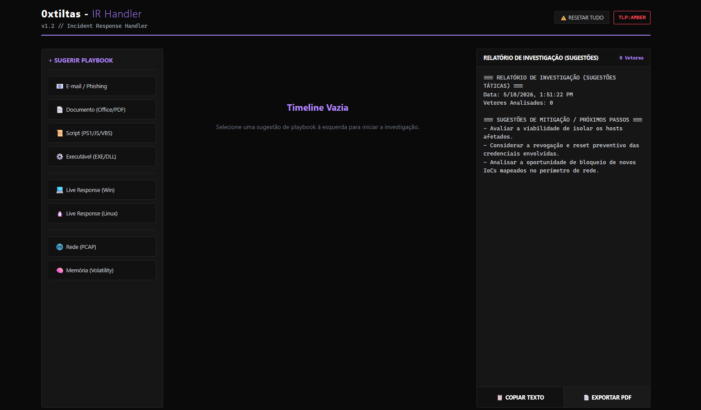

# 🛡️ IR Handler (Incident Response Toolkit)

> **Tactical & Object-Oriented Edition**

Uma ferramenta **Client-Side (HTML/JS/CSS)** projetada para auxiliar Analistas de SOC, CSIRT e Blue Teamers a estruturar o fluxo de pensamento (*Mindset*) durante a análise de incidentes de segurança.


---

## 📸 Preview



---

## 🎯 Objetivo

Em momentos de crise e estresse (Incident Response), o analista pode sofrer de "paralisia por análise" ou esquecer etapas básicas de triagem ao se deparar com o cenário à frente.

O **IR Handler** atua como um **Playbook Interativo e Dinâmico**, fornecendo:
1.  **Mindset Estruturado:** Um fluxo lógico de investigação guiada.
2.  **Kill Chain Tracking:** Capacidade de encadear eventos (Ex: Phishing -> Download -> Execução -> C2).
3.  **Sugestões Táticas:** Sintaxes exatas para ferramentas de mercado (Wireshark, Volatility, Olevba, etc.) apresentadas como sugestões rápidas, economizando tempo de pesquisa e mantendo o analista no controle.
4.  **Relatório Automático:** Geração de um log técnico em tempo real pronto para ser exportado em PDF ou copiado para o ticket do incidente.

## 🚀 Funcionalidades (v1.2)

* **Timeline Cumulativa:** Adicione múltiplos vetores de análise sem perder o histórico anterior.
* **Relatório Live & Export em PDF:** O relatório final é construído dinamicamente conforme você interage, permitindo exportação rápida e limpa em PDF.
* **Arquitetura Modular (OOP):** Código construído sob o paradigma de Orientação a Objetos (ES6 Modules), permitindo fácil escalabilidade e manutenção.
* **Design System Focado:** Interface "Dark Mode" baseada na identidade do laboratório `0xtiltas_`, pensada para não causar fadiga visual em ambientes operacionais escuros.

## 🛠️ Artefatos Suportados

A ferramenta cobre as principais categorias de análise forense:

| Categoria | Ferramentas Sugeridas | Descrição |
| :--- | :--- | :--- |
| **📧 Phishing / E-mail** | `MXToolbox`, `URLScan` | Análise de Headers, SPF/DKIM e Links. |
| **📄 Documentos** | `olevba`, `pdf-parser` | Análise de Macros Maliciosas e PDF Exploits. |
| **📜 Scripts** | `CyberChef`, `Grep` | Desofuscação de PowerShell, Bash, VBS e JS. |
| **⚙️ Executáveis** | `PEStudio`, `Capa`, `Floss` | Análise Estática de Binários (Malware Analysis). |
| **🌐 Rede (PCAP)** | `Wireshark`, `TShark` | Detecção de Beacons, C2 e Exfiltração. |
| **🧠 Memória** | `Volatility 3` | Análise de processos ocultos e injeção de código. |
| **💻 Live Response** | `Sysinternals`, `Linux Cmds` | Triagem rápida em Windows e Linux (Web). |

## 📦 Instalação e Uso

1.  **Clone o repositório:**
    ```bash
    git clone [https://github.com/0xtiltas/ir_handler.git](https://github.com/0xtiltas/ir_handler.git)
    cd ir_handler
    ```

2.  **Execute (Requer Servidor Local):**
    Devido à nova arquitetura modular em ES6, a ferramenta precisa rodar sobre um servidor HTTP para que o navegador permita a importação dos arquivos `.js`.
    
    *Opção A (Python - Recomendado):*
    ```bash
    python3 -m http.server 8080
    ```
    *Opção B (VS Code):*
    Utilize a extensão **"Live Server"**.

3.  **Acesse e Trabalhe:**
    * Abra `http://localhost:8080` no navegador.
    * Selecione as sugestões de playbooks no menu lateral.
    * Valide as evidências e anote customizações.
    * Ao final, clique em **"Exportar PDF"** ou copie o texto para o seu ticket.

## 🤝 Contribuição

Sugestões de novos comandos, ferramentas ou fluxos de análise são bem-vindas! Sinta-se à vontade para abrir uma *Issue* ou enviar um *Pull Request*. O banco de dados de ameaças (`js/database.js`) foi isolado justamente para facilitar contribuições da comunidade.

## ⚠️ Disclaimer

Esta ferramenta é destinada para **uso defensivo** e educacional. O autor não se responsabiliza pelo uso indevido das informações ou ferramentas aqui referenciadas.

---
Desenvolvido por **[// 0xtiltas // & o amiguinho robô 😉]** 💀